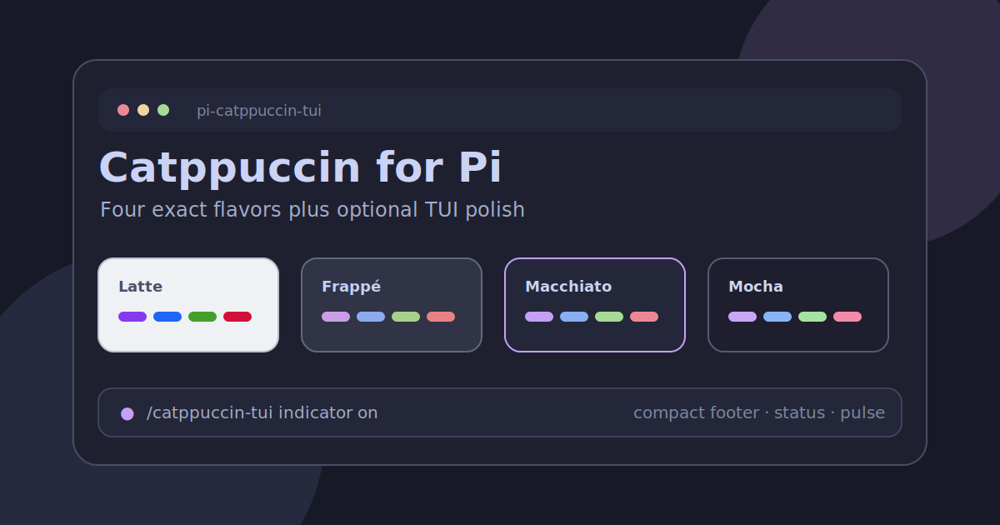

# pi-catppuccin-tui

Exact Catppuccin themes for Pi, with optional Catppuccin-flavored TUI polish.



## What is included

- `catppuccin-tui-latte`
- `catppuccin-tui-frappe`
- `catppuccin-tui-macchiato`
- `catppuccin-tui-mocha`
- Optional `/catppuccin-tui` command for a working indicator, status text, and compact footer

The optional TUI enhancements are off by default. Installing the package gives you the themes and the command, but it does not replace your footer or spinner until you enable them.

## Install

From npm after publish:

```bash
pi install npm:@pi-tama/pi-catppuccin-tui
```

For local testing from this repository:

```bash
pi install /absolute/path/to/pi-catppuccin-tui
```

## Select a theme

Open Pi settings:

```text
/settings
```

Then choose one of:

Pi saves the selected theme in `settings.json`, so it should remain active after `/new`, `/reload`, and restart.

| Flavor    | Pi theme name              | Mood                  |
| --------- | -------------------------- | --------------------- |
| Latte     | `catppuccin-tui-latte`     | Light, soft, readable |
| Frappé    | `catppuccin-tui-frappe`    | Muted dark pastel     |
| Macchiato | `catppuccin-tui-macchiato` | Cozy terminal cockpit |
| Mocha     | `catppuccin-tui-mocha`     | Deep dark Catppuccin  |

Macchiato is the signature flavor for this package.

## Optional TUI enhancements

Enable one enhancement at a time:

```text
/catppuccin-tui indicator on
/catppuccin-tui status on
/catppuccin-tui footer on
```

Enable everything:

```text
/catppuccin-tui all on
```

Disable one enhancement:

```text
/catppuccin-tui footer off
```

Reset all enhancements:

```text
/catppuccin-tui reset
```

Notes:

- `indicator` changes the inline streaming indicator to a small Macchiato pulse.
- `status` adds a Catppuccin status entry to Pi's footer status area.
- `footer` replaces the default footer with a compact Catppuccin telemetry line showing the current model, git branch, token counts, and cost.
- Enabled enhancements persist after `/reload` and new sessions once you opt in. `/catppuccin-tui reset` clears the saved opt-in.

## Verify before publishing

```bash
npm run build:themes
find themes -name '*.json' -print0 | xargs -0 jq empty
npm run validate
npm pack --dry-run --json
```

Manual checks before publishing:

1. Install the local package with `pi install /absolute/path/to/pi-catppuccin-tui`.
2. Select each theme in `/settings`.
3. Inspect editor borders, footer, markdown, tool boxes, diffs, and thinking-level colors.
4. Toggle the optional enhancements with `/catppuccin-tui`.
5. Run `/reload` and confirm enabled enhancements stay on.

Do not publish until the local install and visual pass are complete.

## Palette source

Palette values are copied from the official Catppuccin palette:

- https://catppuccin.com/palette/
- https://github.com/catppuccin/catppuccin/blob/main/docs/style-guide.md

## License

MIT
